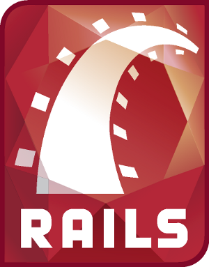

!SLIDE title-slide

# Ruby on Rails

## framework webowy
## który wpłynie na Twoje życie
### (albo już to zrobił)
## 
## 

!SLIDE bullets incremental

# Dlaczego Railsy są inne?

* rubiowe "zorientowanie na programistę"
* abstrakcja wyciągnięta z prawdziwych projektów
* "Opinionated Software"
* Konwencja Ponad Konfiguracją

!SLIDE bullets incremental

# Założenia Rails

* wzorzec MVC
* DRY: Don't Repeat Yourself
* Agile development
* Struktura katalogów
* i szkielet aplikacji

!SLIDE bullets

# Kultura świata Ruby

* Open-Source
* Automated Testing
* Git + Github
* frajda programisty, least-surprise

!SLIDE bullets

# Wpływ Ruby i Rails

* Java: Groovy, Groovy On Grails
* Python: Django
* PHP: CakePHP, Symfony

!SLIDE

# Pohakujemy trochę?

## Zobaczmy na prostym przykładzie jak łatwo i szybko zbudować aplikację w Ruby On Rails
